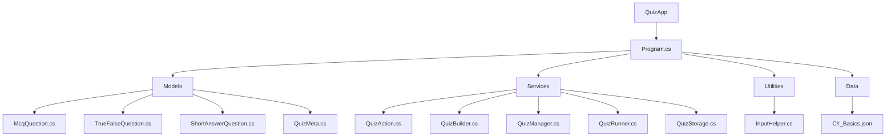
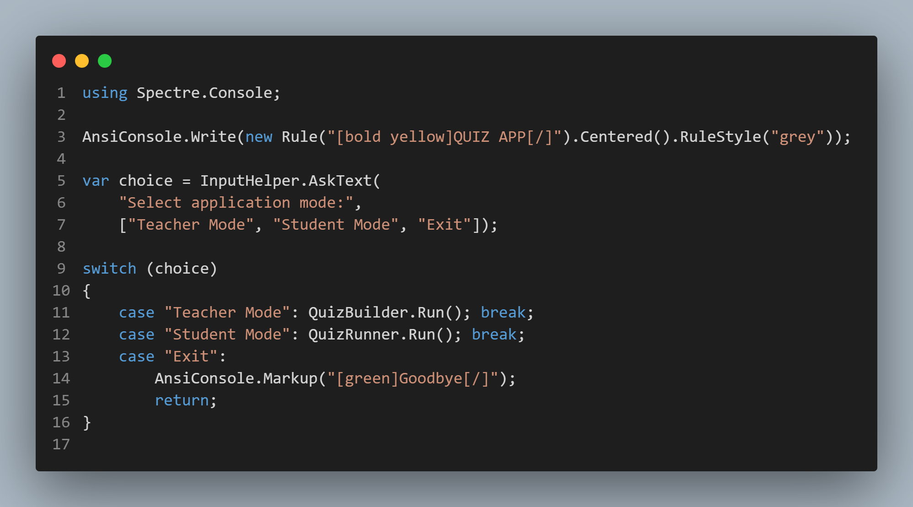

### "QuizApp" console project


<details>
<summary>🎤 Kirish </summary>

  #### ⚙️ QuizApp project ning asosiy vazifasi student va teacher mode da ishlab bilimlarni mustahkamlashga yo'naltirilgan


- #### "You don’t have to be great to start, but you have to start to be great."

</details>

<details>
<summary>🧩 Loyiha haqida umumiy tushuncha</summary>
  
##### “ QuizApp ” — bu o‘qituvchi va talabalar rejimida ishlaydigan dastur.
- Bu dasturning asosiy funksiyalari:
```
        ✔️ Quizlarni yaratish va ularga vaqt belgilash
        ✔️ Quizlarni  disable yoki enable qilish va o‘chirish
        ✔️ Savollarga javob berish
        ✔️ Natijani ko‘rish
        ✔️ JSON fayl bilan savollarni serializa deserialize qilish
```
##### Readability va Reusability  qulay bo'lish uchun project qismlarga break qilingan, keling project skeletini ko'rib chiqamiz 


##### Program.cs  da ham juda kop code yozilmagan , shunchaki tanlangan mode ga qarab boshqa bir classga yo'naltirilgan

</details>

<details>
<summary> 💻 Live Demo </summary>

[▶️ Project qanday ishlashi haqida qisqa videoni tomosha qilish](https://drive.google.com/file/d/1z8hSk4AAZdeXfJdSV2uxWVSHbsTj0Hy1/view?usp=drive_link)

</details>

<details>
<summary> 🧠  Code Walkthrough</summary>

  ##### Keling projectning bir qismidagi code ni ko'rib o'tamiz
  
```csharp
using Spectre.Console;

public static class QuizBuilder
{
    public static void Run()
    {
        AnsiConsole.Write(
            new Rule("[bold yellow]TEACHER MODE[/]")
                .Centered()
                .RuleStyle("grey"));

        var option = InputHelper.AskText(new[] { "Create quiz", "Manage quizzes", "Exit" });

        switch (option)
        {
            case "Create quiz": CreateQuiz(); break;
            case "Manage quizzes": QuizManager.Run(); break;
            case "Exit": return;
        }
    }

    public static void CreateQuiz()
    {
        var quizTitle = InputHelper.AskText("[ Title of new quiz ]");
        var quizDescription = InputHelper.AskText("[ Short description ]");
        bool IsActive = true;
        var questions = new List<Dictionary<string, object>>();
        var quiz = new Dictionary<string, object>()
        {
            ["Title"] = quizTitle,
            ["Description"] = quizDescription,
            ["IsActive"] = IsActive,
            ["Questions"] = questions
        };
        while (true)
        {
            var quizType = InputHelper.AskText($"Add questions to “{quizTitle}”", ["Add MCQ", "Add True/False", "Add Short Answer", "Finish Quiz"]);

            switch (quizType)
            {
                case "Add MCQ":
                    questions.Add(McqQuestion.Run());
                    break;
                case "Add True/False":
                    questions.Add(TrueFalseQuestion.Run());
                    break;
                case "Add Short Answer":
                    questions.Add(ShortAnswerQuestion.Run());
                    break;
                case "Finish Quiz":
                    QuizStorage.ViewSummary(questions);
                    var saveOption = InputHelper.AskConfirmation("Save quiz? [y/n]");

                    if (saveOption)
                    {
                        QuizStorage.SaveQuizAsJson(quiz);
                    }
                    return;
            }
        }
    }

}
```

#####  ---- MCQ Questions ----
```csharp
using System.Reflection.Emit;
using Spectre.Console;

public static class McqQuestion
{
    public static Dictionary<string, object> Run()
    {
        var question = InputHelper.AskText("Question prompt");

        int? countOfOptions = InputHelper.AskInt("How many options would be? [ count must be integer]");


        var optionsDictioanry = new Dictionary<string, string> { };


        char i = 'A';
        for (var _ = 0; _ < countOfOptions; _++)
        {
            optionsDictioanry[i.ToString()] = InputHelper.AskText($"Option {i}");
            i++;
        }

        var correctOptionKey = InputHelper.AskText("Correct option key", optionsDictioanry.Keys.ToArray());

        int? timeLimit = InputHelper.AskInt("Time limit in seconds (ENTER for none)");

        var mcq = new Dictionary<string, object>
        {
            ["Type"] = "MCQ",
            ["Prompt"] = question,
            ["Options"] = optionsDictioanry,
            ["Answer"] = correctOptionKey
        };

        if (timeLimit.HasValue)
        {
            mcq["TimeLimitSeconds"] = timeLimit.Value;
        }

        AnsiConsole.MarkupLine($"[green]Question added to MCQ successfully[/]");
        return mcq;
    }
}

```
#####  ---- Short Answers ----
```csharp
public static class ShortAnswerQuestion
{
    public static Dictionary<string, object> Run()
    {
        var question = InputHelper.AskText("Question prompt");

        var correctOptionKey = InputHelper.AskText("[ Correct option key ]");

        int? timeLimit = InputHelper.AskInt("[ Time limit in seconds (ENTER for none) ]");

        var mcq = new Dictionary<string, object>
        {
            ["Type"] = "ShortAnswer",
            ["Prompt"] = question,
            ["Answer"] = correctOptionKey

        };
        if (timeLimit.HasValue)
        {
            mcq["TimeLimitSeconds"] = timeLimit;
        }
        return mcq;
    }
}


```
#####  ---- True/False Questions ----
```csharp
public static class TrueFalseQuestion
{
    public static Dictionary<string, object> Run()
    {
        var question = InputHelper.AskText("Question prompt");

        var correctOptionKey = InputHelper.AskText("Correct option key", ["True", "False"]);

        var trueFalse = new Dictionary<string, object>
        {
            ["Type"] = "True/False",
            ["Prompt"] = question,
            ["Answer"] = correctOptionKey
        };
        return trueFalse;
    }

}

```


</details>

<details>
<summary> 📌 Summary</summary>

- ##### "QuizApp" bu men bajargan 1-project , hattoki u mini console project bolsa ham , g'ij-g'ij bilim bo'ldi
- ###### Nimalar o'rgandim :
-  ✅ Spectre library yangilik boldi , project davomida uni qisman o'rgandim va kerakli joylarda to'gri foydalandim.
-  ✅ Birinchi martta Json fayldan o'qish va unga yozish kerak bo'lgan real case ga duch keldm.
-  ✅ Collections dan foydalandim


</details>
