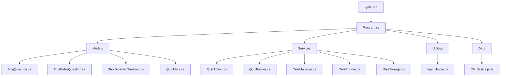

### "QuizApp" console project


<details>
<summary>🎤 Kirish </summary>

- User opens quiz builder  
- Adds questions  
- Saves to file

</details>

<details>
<summary>🧩 Loyiha haqida umumiy tushuncha</summary>
  
### “ QuizApp ” — bu o‘qituvchi va talabalar rejimida ishlaydigan dastur.
- Bu dasturning asosiy funksiyalari:
```
        ✔️ Quizlarni yaratish va ularga vaqt belgilash
        ✔️ Quizlarni  disable yoki enable qilish va o‘chirish
        ✔️ Savollarga javob berish
        ✔️ Natijani ko‘rish
        ✔️ JSON fayl bilan savollarni serializa deserialize qilish
```
### Readability va Reusability  qulay bo'lish uchun project qismlarga break qilingan, keling project skeletini ko'rib chiqamiz 


### Program.cs  da ham juda kop code yozilmagan , shunchaki tanlangan mode ga qarab boshqa bir classga yo'naltirilgan

</details>

<details>
<summary> 💻 Live Demo </summary>

- System detects existing quiz  
- User declines to overwrite

</details>

<details>
<summary> 🧠  Code Walkthrough</summary>

- Show how quizzes can be toggled or removed

</details>

<details>
<summary> 📌 Summary</summary>

- #### "QuizApp" bu men bajargan 1-project , hattoki u mini console project bolsa ham , g'ij-g'ij bilim bo'ldi
- ##### Nimalar o'rgandim :
-  ✅ Spectre library yangilik boldi , project davomida uni qisman o'rgandim va kerakli joylarda to'gri foydalandim.
-  ✅ Birinchi martta Json fayldan o'qish va unga yozish kerak bo'lgan real case ga duch keldm.
-  ✅ Collections dan foydalandim


</details>
